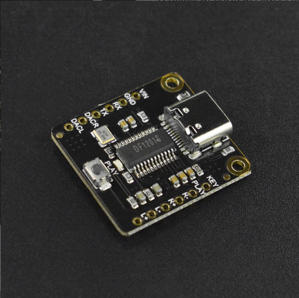

# DFRobot_DF1201S
您是否在寻找一款简单又强大的MP3播放模块？看这里！这款MP3播放模块支持<br>
arduino、AT指令、板载按键和AD按键四种控制方式。 <br>
通过板载按键即使在没有微控制器的情况下也能进行音乐播放和切换。模块搭载<br>
了128MB的存储空间，通过USB线您可以很容易的将您喜欢的音乐拷贝到模块中。<br>
该模块可作为电脑或Raspberry Pi声卡，用USB数据线将模块和电脑连接，电脑<br>
播放音乐即可通过该 模块输出。<br>




## 产品链接（https://www.dfrobot.com.cn/goods-3046.html）

    SKU：DFR0768
	
## Table of Contents

* [Summary](#summary)
* [Installation](#installation)
* [Methods](#methods)
* [Compatibility](#compatibility)
* [History](#history)
* [Credits](#credits)

## Summary

1. 播放音乐

## Installation

要使用此库，首先下载库文件，将其粘贴到\Arduino\libraries目录中，然后打开examples文件夹并运行该文件夹中的demo。

## Methods
```C++
  /**
   * @fn begin
   * @brief init function
   * @param s serial
   * @return Boolean type, Indicates the initialization result
   * @retval true The setting succeeded
   * @retval false Setting failed
   */
  bool begin(Stream &s);
  
  /**
   * @fn isPlaying
   * @brief Detects and refreshes the play status
   * @return Boolean type, Indicates the play result
   * @retval true be playing
   * @retval false has stopped
   */
  bool isPlaying();
  
  /**
   * @fn setBaudRate
   * @brief Set baud rate(Need to power off and restart, power-down save)
   * @param baud 9600,19200,38400,57600,115200
   * @return Boolean type, the result of seted
   * @retval true The setting succeeded
   * @retval false Setting failed
   */
  bool setBaudRate(uint32_t baud);

  /**
   * @fn setPlayMode
   * @brief Set playback mode 
   * @param mode ePlayMode_t:SINGLECYCLE,ALLCYCLE,SINGLE,RANDOM,FOLDER
   * @return Boolean type, the result of seted
   * @retval true The setting succeeded
   * @retval false Setting failed
   */
  bool setPlayMode(ePlayMode_t mode);

  /**
   * @fn setLED
   * @brief Set indicator LED(Power-down save) 
   * @param on true or false
   * @return Boolean type, the result of seted
   * @retval true The setting succeeded
   * @retval false Setting failed
   */
  bool setLED(bool on);
  
  /**
   * @fn setPrompt
   * @brief Set the prompt tone(Power-down save) 
   * @param on true or false
   * @return Boolean type, the result of seted
   * @retval true The setting succeeded
   * @retval false Setting failed
   */
  bool setPrompt(bool on);
  
  /**
   * @fn setVol
   * @brief Set volume 
   * @param vol 0-30
   * @return Boolean type, the result of seted
   * @retval true The setting succeeded
   * @retval false Setting failed
  */
  bool setVol(uint8_t vol);
  
  /**
   * @fn switchFunction
   * @brief Set working mode 
   * @param function eFunction_t:MUSIC,RECORD,UFDISK
   * @return Boolean type, the result of seted
   * @retval true The setting succeeded
   * @retval false Setting failed
   */
  bool switchFunction(eFunction_t function);
  
  /**
   * @fn next
   * @brief Next 
   * @return Boolean type, the result of operation
   * @retval true The setting succeeded
   * @retval false Setting failed
   */
  bool next();
  
  /**
   * @fn last
   * @brief Previous 
   * @return Boolean type, the result of operation
   * @retval true The setting succeeded
   * @retval false Setting failed
   */
  bool last();
  
  /**
   * @fn start
   * @brief Play 
   * @return Boolean type, the result of operation
   * @retval true The setting succeeded
   * @retval false Setting failed
   */
  bool start();
  
  /**
   * @fn pause
   * @brief Pause 
   * @return Boolean type, the result of operation
   * @retval true The setting succeeded
   * @retval false Setting failed
   */
  bool pause();
  
  /**
   * @fn delCurFile
   * @brief Delete the currently-playing file 
   * @return Boolean type, the result of operation
   * @retval true The setting succeeded
   * @retval false Setting failed
   */
  bool delCurFile();
  
  /**
   * @fn playSpecFile
   * @brief Play file of the specific path 
   * @return Boolean type, the result of operation
   * @retval true The setting succeeded
   * @retval false Setting failed
   */
  bool playSpecFile(String str);
  
  /**
   * @fn playFileNum
   * @brief Play the file of specific number, the numbers are arranged according to the sequences the files copied into the U-disk 
   * @param num file number, can be obtained by getCurFileNumber()
   * @return Boolean type, the result of operation
   * @retval true The setting succeeded
   * @retval false Setting failed
   */
  bool playFileNum(int16_t num);

  /**
   * @fn getVol
   * @brief Get volume 
   * @return vol volume
   */
  uint8_t getVol();

  /**
   * @fn getPlayMode
   * @brief Get palyback mode 
   * @return ePlayMode_t ：Play Mode
   */
  ePlayMode_t getPlayMode();
  
  /**
   * @fn getCurFileNumber
   * @brief Get file number 
   * @return  file number
   */
  uint16_t getCurFileNumber();
  
  /**
   * @fn getTotalFile
   * @brief Get the number of files available to play 
   * @return Total number of files
   */
  uint16_t getTotalFile();
  
  /**
   * @fn getCurTime
   * @brief Get the time length the current song has played 
   * @return Time node
   */
  uint16_t getCurTime();
  
  /**
   * @fn getTotalTime
   * @brief Get the total length of the currently-playing song
   * @return The total number of time
   */
  uint16_t getTotalTime();
  
  /**
   * @fn getFileName
   * @brief Get the name of the playing file 
   * @return A string representing the filename
   */
  String   getFileName();
  
  /**
   * @fn enableAMP
   * @brief Enable Amplifier chip
   * @return Boolean type, the result of operation
   * @retval true The setting succeeded
   * @retval false Setting failed
   */
  bool enableAMP();
  
  /**
   * @fn disableAMP
   * @brief Disable Amplifier chip
   * @return Boolean type, the result of operation
   * @retval true The setting succeeded
   * @retval false Setting failed
   */
  bool disableAMP();
  
  /**
   * @fn fastForward
   * @brief Fast forward the currently-playing song
   * @param second  FF time(Unit: S) 
   * @return Boolean type, the result of operation
   * @retval true The setting succeeded
   * @retval false Setting failed
   */
  bool fastForward(uint16_t second);
  
  /**
   * @fn fastReverse
   * @brief Fast Rewind the currently-playing song 
   * @param second  FR time(Unit: S)
   * @return Boolean type, the result of operation
   * @retval true The setting succeeded
   * @retval false Setting failed
   */
  bool fastReverse(uint16_t second);
  
  /**
   * @fn setPlayTime
   * @brief Let the currently-playing song start playing from a particular time point 
   * @param second  Fixed time point
   * @return Boolean type, the result of operation
   * @retval true The setting succeeded
   * @retval false Setting failed
   */
  bool setPlayTime(uint16_t second);
```

## Compatibility

MCU                | Work Well    | Work Wrong   | Untested    | Remarks
------------------ | :----------: | :----------: | :---------: | -----
Arduino Uno        |      √       |              |             | 
Mega2560        |      √       |              |             | 
Leonardo        |      √       |              |             | 
ESP32        |      √       |              |             | 
ESP8266        |      √       |              |             | 
M0        |      √       |              |             | 


## History

- 2021/06/4  - Version 1.0.0 released.
- 2021/10/15 - Version 1.0.1 released.
- 2023/10/09 - Version 1.0.2 released.

## Credits

Written by fengli(li.feng@dfrobot.com), 2021. (Welcome to our [website](https://www.dfrobot.com/))


